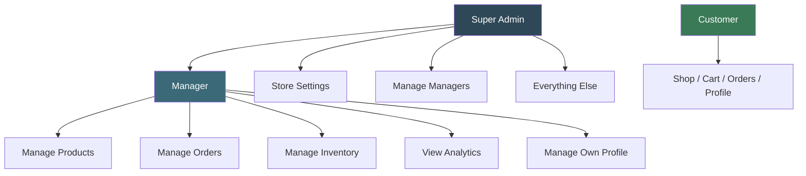
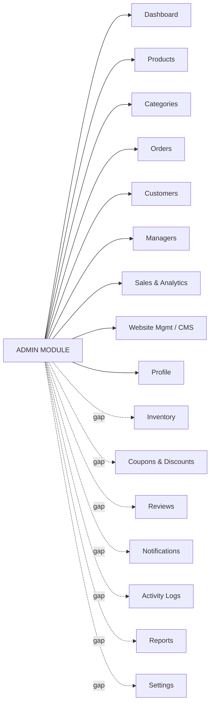
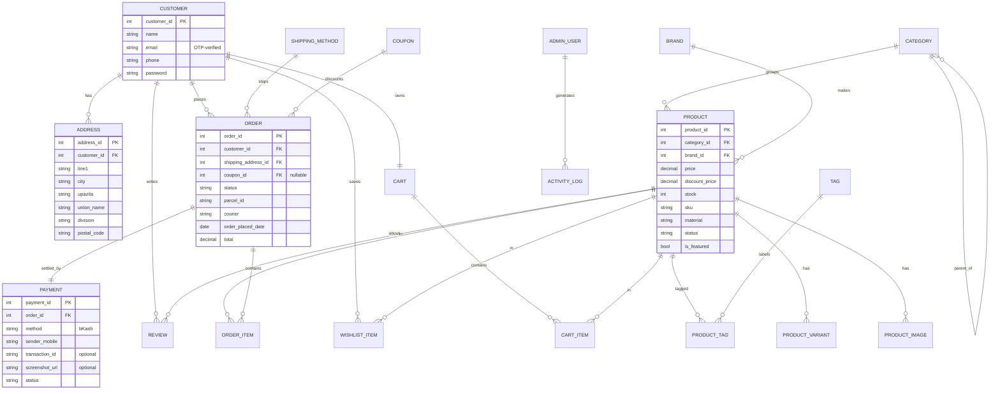
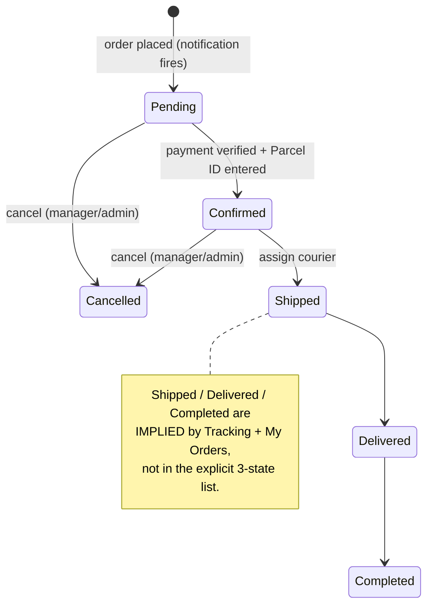
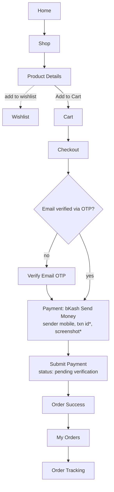
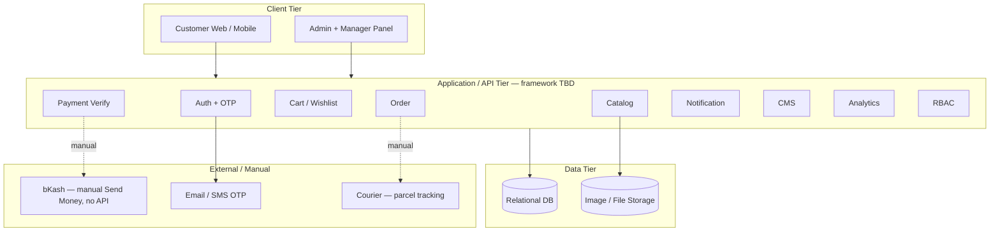

# E-Commerce Platform — System Specification (v1)
### Faithful extraction from the provided source brain-dump

> **Status of this document.** Everything below is a *faithful, de-duplicated reorganisation*
> of the spec you provided. Nothing has been invented. Three confidence levels are used:
>
> - **(spec)** — stated explicitly in your source.
> - **(inferred)** — a reasonable model implied by your source; **confirm before building**.
> - **⚠ GAP / ⚠ CONFLICT** — named-but-undefined, contradictory, or ambiguous; **needs a decision**.
>
> Hand this file to Claude Code as the build brief. **Do not start coding before the
> "Decisions needed" section is answered** — every unanswered item is a place where the
> running software will silently diverge from what your poster claims.

---

## 1. System overview (spec)

A fashion / clothing **e-commerce platform** built for the Bangladesh market, with two faces:

- **Customer storefront** — browse, search, cart, wishlist, checkout, order tracking, profile.
- **Admin / Manager back-office** — catalogue, orders, customers, analytics, CMS, staff management.

Distinctive (and thesis-relevant) design decisions taken from the source:

- **Manual bKash "Send Money" payment** — no payment-gateway API. Customer pays, then submits a sender mobile number (transaction ID and screenshot are *optional*).
- **Manual fulfilment** — a manager enters a **Parcel ID** by hand and clicks *Confirm*.
- **Email OTP verification** is required (placement ambiguous — see ⚠ below).
- **Bangladesh address model** — Division / District / Upazila / Union / Postal code.

---

## 2. Actors & role-based access control (RBAC)

Three actors (spec): **Customer**, **Manager**, **Super Admin**.

| Capability | Customer | Manager | Super Admin |
|---|:---:|:---:|:---:|
| Browse / cart / wishlist / checkout / track own orders | ✓ | — | — |
| Manage own profile | ✓ | ✓ | ✓ |
| Manage products (add / edit / delete / stock) | — | ✓ | ✓ |
| Manage orders (view / confirm / cancel / update status / assign courier) | — | ✓ | ✓ |
| Manage inventory | — | ✓ | ✓ |
| View analytics | — | ✓ | ✓ |
| View customers | — | ✓ | ✓ |
| Website management / CMS | — | ⚠ partial¹ | ✓ |
| Add / edit / delete **categories** | — | ⚠ no² | ✓ |
| Manage managers (add / edit / remove / reset password) | — | — | ✓ |
| Store settings | — | — | ✓ |

> ¹ Source says a manager "can do it" only for **Featured Products** in Website Management — unclear if managers get the full CMS. **Decision needed.**
> ² Source: "**Only Admin** can Add/Edit/Delete Category" — yet managers manage products, which depend on categories. **Confirm** managers truly cannot touch categories.

---

## 3. Admin / back-office modules

**Defined in source (spec):**

- **Dashboard** — cards: Total Revenue, Today's Revenue, Monthly Revenue, Total Orders, Pending Orders, Delivered Orders, Cancelled Orders, Total Customers, Total Products. New orders trigger a dashboard notification.
- **Products** — Add / Edit / Delete; Images; Variants; Stock; Price; Discount; Featured; Status. Per-product fields: Name, Description, Category, Brand, Price, Discount Price, Stock, SKU, Images, Sizes, Colors, Material, Weight, Tags, Status.
- **Categories** — Men, Women, Kids, Accessories (→ Cap → Mask), Shoes, Winter, Summer. Admin-only CRUD.
- **Orders** — list filtered by Pending / Confirmed / Cancelled. Per order: Order ID, Customer ID, product details, quantity, price, shipping address, Parcel ID, order-placed date. Rules: manager enters Parcel ID **before** Confirm; manager/admin may mark Cancelled; OTP email verification required; customer address + mobile captured at checkout and shown to staff.
- **Customers** — Name, Email, Phone, Address, Total Orders, Total Spending. **View-only** for admin + manager.
- **Managers** (Super-Admin only) — Add / Edit / Remove; assign email + password; Reset Password. Manager panel scope: Dashboard, Products, Orders, Customers, Inventory, Analytics.
- **Sales & Analytics** — Revenue, Profit, Orders, Products Sold, Top Selling Products, Top Categories, Customer Growth, Monthly / Weekly / Daily Sales. Charts: Bar, Pie, Line.
- **Website Management (CMS)** — Homepage Banner, Hero Slider, Featured Products, Latest Collection, About Us, Contact Information, Social Media Links, Footer.
- **Profile** — Personal info (picture, full name), Contact (primary + secondary email, mobile 1–3, address with required Line 1 / City / Upazila / Division / Postal, optional Line 2 / Union), Account settings (change password / email), Actions.

**⚠ Named in the module list but NOT specified anywhere (gaps to define):**

- **Inventory** — distinct from product `stock`? Stock-in/out, low-stock alerts?
- **Coupons & Discounts** — yet the cart has a "Coupon Code" field. Rules/types undefined.
- **Reviews** — product reviews exist on the storefront; admin moderation flow undefined.
- **Notifications** — channels (in-app / email / SMS), triggers undefined.
- **Activity Logs** — what is logged, retention undefined.
- **Reports** — separate from Analytics? Export formats undefined.
- **Settings** — store-level settings list undefined.

---

## 4. Customer storefront modules (spec)

- **Home** — Announcement Bar, Nav Bar, Hero Banner, Featured Categories, New Arrivals, Best Sellers, Flash Sale, Trending, Featured Collection, Why Choose Us, Customer Reviews, Instagram Gallery, Newsletter, Footer.
- **Shop** — filters (Category, Brand, Price, Size, Color, Discount, Availability), Sort, Product Grid, Pagination, Search Bar.
- **Categories** — Men, Women, Kids, Shoes, Accessories, Winter Collection, Summer Collection, Sale. ⚠ *differs from admin category list (see conflicts).*
- **Product Details** — Gallery + Zoom, Name, Brand, Price, Discount, Rating, Stock Status, Size + Color selection, Quantity, Add to Cart, Buy Now, Wishlist, Share, Description, Specifications, Reviews, Related, Recently Viewed.
- **Search** — Products, Suggestions, Recent Searches, Results.
- **Wishlist** — View, Move to Cart, Remove, Share.
- **Cart** — Items, Quantity update, Remove, **Coupon Code**, Shipping Charge, Order Summary, Proceed to Checkout.
- **Checkout** — Customer Info, Shipping Address, Billing Address *(optional)*, Shipping Method, Payment Method, Order Summary, Place Order.
- **Payment** — bKash Send-Money instructions, store bKash number, sender mobile, Transaction ID *(optional)*, Upload Screenshot *(optional)*, Submit.
- **Order Success** — Thank You, Order ID, Payment Status, Estimated Delivery, Continue Shopping.
- **Order Tracking** — Status, Parcel ID, Courier, Timeline, Delivery Progress.
- **My Orders** — Current / Completed / Cancelled, Order Details, Download Invoice.
- **Customer Profile** — Dashboard, Personal Info, Address Book / Saved Addresses, Wishlist, My Orders, Payment History, Notifications, Change Password / Email, Logout.
- **Authentication** — Login, Register, Verify Email (OTP), Forgot / Reset Password, Logout.
- **Static** — About Us, Contact Us (+ Google Map), FAQ, Privacy Policy, Terms, Return & Refund Policy, Shipping Policy, Footer.

---

## 5. Data model

Entities and relationships below are **inferred** from the field lists in your source. Confirm before Claude Code generates migrations. Amber/⚠ entities correspond to undefined modules — their fields are provisional.

Other entities: `PRODUCT_IMAGE`, `PRODUCT_VARIANT(size,color,stock)`, `TAG`/`PRODUCT_TAG`,
`CART_ITEM`, `WISHLIST_ITEM`, `ORDER_ITEM(qty,unit_price)`, `SHIPPING_METHOD(name,charge)`,
`ADMIN_USER(role: super_admin|manager)`, and ⚠ provisional `COUPON`, `REVIEW`,
`NOTIFICATION`, `ACTIVITY_LOG`, plus CMS/Settings content storage.

> Modelling decisions to confirm: (a) `PRODUCT→CATEGORY` is **1:N** per your source's single
> "Category" field — most stores use **M:N**; (b) Sizes/Colors are modelled as `PRODUCT_VARIANT`
> rows (so each size+color can carry its own stock) — your source lists them as plain fields;
> (c) `Brand` is promoted to its own table because a Brand filter exists.

---

## 6. Order lifecycle (state machine)

Your source lists **only three** order states (Pending, Confirmed, Cancelled), but the dashboard,
Order Tracking and My Orders imply **more**. The dashed states below are *implied, not explicit* —
you must confirm the full lifecycle or Claude Code will guess.

---

## 7. Customer purchase flow

> ⚠ **OTP placement conflict.** Authentication lists "Verify Email (OTP)" at **registration**,
> while Orders says email "must be verified with OTP" at **order time**. Decide: register-time,
> checkout-time, or both.

---

## 8. Payment & fulfilment model (the distinctive part)

1. Customer manually sends money to the store's bKash number.
2. Customer submits **sender mobile number**; transaction ID and screenshot are **optional**.
3. Order is created in **Pending**; dashboard notification fires.
4. A manager manually **verifies** the payment, enters the **Parcel ID**, clicks **Confirm**.
5. Courier assigned; customer tracks via Parcel ID + timeline.

> ⚠ **Verification weakness to address (and to defend on your poster).** Because txn ID and
> screenshot are optional, a Pending order may carry **no verifiable proof of payment**. Either
> tighten this (require at least one proof) or be ready to justify the trade-off (friction vs.
> fraud) — examiners will ask.

---

## 9. Reference architecture (stack TBD)

---

## 10. ⚠ Open issues, conflicts & gaps (the accuracy section)

1. **Order states under-specified** — 3 listed, ≥6 implied. *(see §6)*
2. **Category lists disagree** — admin: Winter / Summer + Accessories→Cap→Mask; storefront: Winter Collection / Summer Collection / **Sale**. "Sale" is really a discount filter, not a category.
3. **Featured products managed in two places** — Products module *and* Website Management. Pick one source of truth.
4. **OTP placement** — registration vs. checkout vs. both. *(see §7)*
5. **Coupons undefined** but used in cart; **Reviews/Inventory/Notifications/Reports/Settings/Activity Logs** named but unspecified. *(see §3)*
6. **Billing address** — storefront marks it optional; admin checkout lists it plainly. Confirm.
7. **Address granularity mismatch** — admin profile uses Upazila/Union/Division/Postal; customer storefront address fields are looser. Unify.
8. **No refund/return workflow** despite a "Return & Refund Policy" page. Define or scope out.
9. **Stock vs. variant stock** — is stock tracked per product or per size/color variant?
10. **Payment proof optional** — verification weakness. *(see §8)*

---

## 11. ⚠ Decisions needed before Claude Code builds

**A. Thesis framing** — is this a *software-engineering build project* (the system is the deliverable) or a *research study* (a question + evaluation)? This changes whether the report/poster needs Abstract / Research Question / Methodology / Evaluation sections.

**B. Build scope** — build **all** modules, or commit to a defensible **core** (catalogue + cart + checkout + manual bKash + order lifecycle + RBAC + analytics) and label the rest *future work*? A thesis rarely builds 16 admin modules + 16 storefront sections *well*.

**C. Tech stack** — name it (e.g. MERN, Laravel + MySQL, Django + Postgres, Next.js + Postgres). This finalises the architecture diagram and non-functional requirements.

Once A–C are answered, resolve the §10 conflicts, then this file is build-ready.

---

## 12. Appendix — source typos to fix before any poster/print

`canseled → cancelled` · `orgeder → order` · `pleased → placed` · `musk → mask` ·
`samdme → same` · `Foote → Footer` · `Upojela → Upazila` · `requred → required` ·
`canceled/canseled` (use one spelling consistently).
